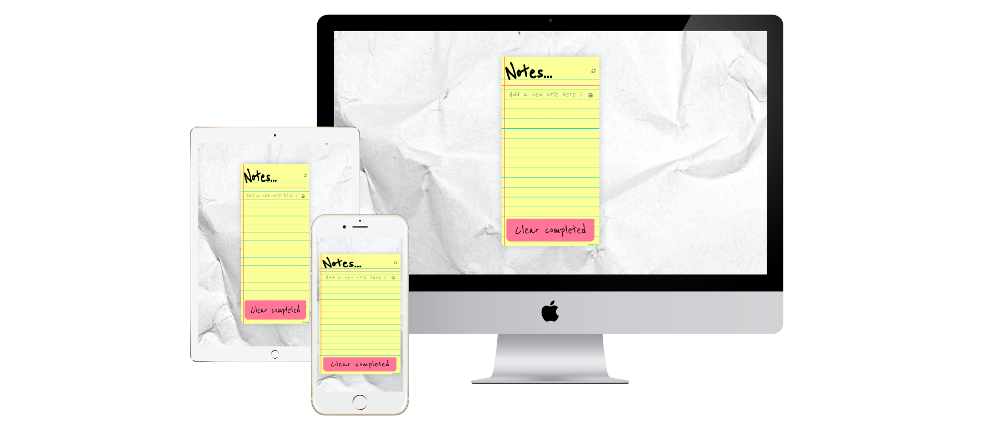

# Notely✔️!📋✏️🎒

A minimalist note app, ES6 compliant and bundled with Webpack.



## Built With

- HTML
- JavaScript
- CSS
- Webpack

### Getting started
```
npm install
```
```
npm start
```
## Authors

:bust_in_silhouette: Jose Ramon

- GitHub: @jr-cast
- Twitter: @josercastanos
- LinkedIn: https://www.linkedin.com/in/jr-cast


## Contributing

Contributions, issues, and feature requests are welcome!

Feel free to check the issues page.

## Show your support

Give a :star: if you like this project!
